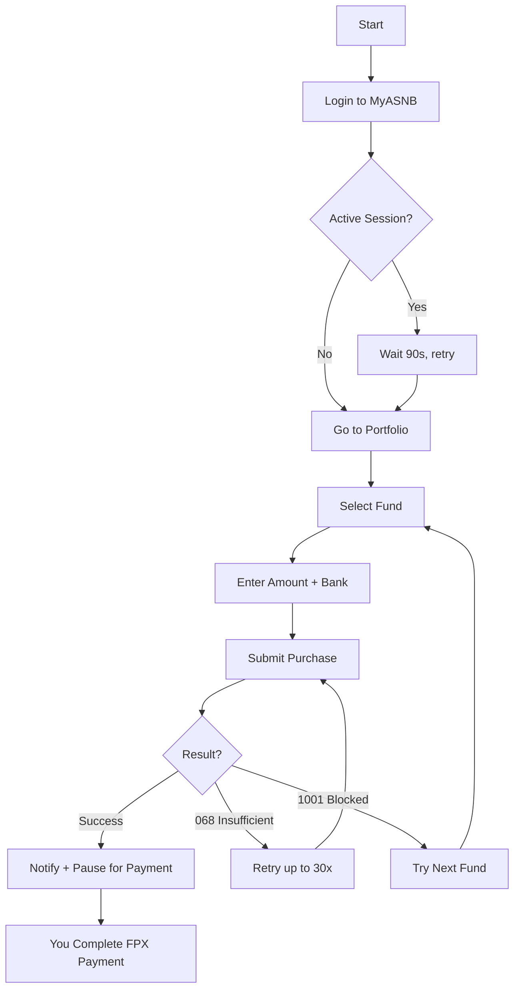

<p align="center">
  
</p>

<h1 align="center">MyASNB Buyer Automation</h1>

<p align="center">
  <strong>Stop refreshing. Let the bot retry for you.</strong>
</p>

<p align="center">
  
  
  
  
</p>

<p align="center">
  <a href="https://ko-fi.com/yenwee"></a>
</p>

---

## The Problem

ASNB fixed-price funds (ASM, ASM2, ASM3) are almost always fully subscribed. When units become available, they sell out in **seconds**. Buying manually means:

- Refreshing the portal over and over
- Clicking through 5 screens as fast as possible
- Getting "insufficient units" errors 99% of the time
- Doing this for hours, days, or weeks

## The Solution

This tool sits in the retry loop for you. It logs in, selects your fund, submits the purchase, and **retries automatically** when units aren't available. When it finally succeeds, it notifies you and pauses for you to complete the FPX bank payment manually.

**You set it up once, walk away, and get an email when it's time to pay.**

### Key Features

- **Multi-account** -- run multiple MyASNB accounts simultaneously
- **Smart retry** -- handles "insufficient units" (068) with automatic retry, skips "blocked" (1001) funds
- **GUI + CLI** -- visual launcher with per-account tabs, or simple `make run P=profile`
- **Per-profile settings** -- different bank, amount, and funds for each account
- **Email alerts** -- get notified with a screenshot when purchase succeeds
- **Session management** -- auto-refreshes login to prevent stale data
- **Debug snapshots** -- screenshots + reports saved on any failure

> **Note:** This tool automates everything *except* the actual payment. You must complete the FPX bank transfer yourself when prompted.

> **Legal:** This uses your own credentials for personal use. No security measures are bypassed. Use at your own risk -- see [Disclaimer](#disclaimer).

---

## Quick Start

### macOS / Linux

```bash
git clone https://github.com/yenwee/asnb_buyer_app.git
cd asnb_buyer_app
make setup                 # creates venv, installs deps, copies config template
# Edit config.ini -- add your [Profile.xxx] section (see below)
make run P=yourprofile     # CLI mode
make gui                   # GUI mode (all profiles)
```

### Windows

```
git clone https://github.com/yenwee/asnb_buyer_app.git
cd asnb_buyer_app
setup.bat                  # creates venv, installs deps, copies config template
# Edit config.ini -- add your [Profile.xxx] section (see below)
run.bat yourprofile        # CLI mode
gui.bat                    # GUI mode (all profiles)
```

## How It Works



## Configuration

### Profile Setup

Each `[Profile.xxx]` section in `config.ini` is one MyASNB account:

```ini
[Profile.ali]
username = asnb1234              # MyASNB login ID
password = MyP@ssw0rd            # MyASNB password
security_phrase = my phrase       # Phrase shown after username entry
bank_name = Maybank2U            # FPX bank (see list below)
purchase_amount = 1000           # RM per attempt
funds_to_try = Amanah Saham Malaysia, Amanah Saham Malaysia 2
recipient_email = ali@gmail.com  # Email notification
```

You can have as many profiles as you want. Run them all at once with `make gui` or one at a time with `make run P=ali`.

### Global Defaults

`[Settings]` provides fallbacks for any field not set in a profile:

```ini
[Settings]
funds_to_try = Amanah Saham Malaysia 2
purchase_amount = 100
bank_name = Public Bank
loop_tries = 0                   # 0 = infinite retry
session_refresh_interval = 6     # re-login every N fund attempts
```

### Available Banks

Affin Bank, Alliance Bank, AmBank, Bank Islam, Bank Rakyat, Bank Muamalat, CIMB Clicks, Hong Leong Bank, HSBC Bank, Maybank2U, Public Bank, RHB Bank, UOB Bank, BSN, KFH, Maybank2E, OCBC Bank, Standard Chartered, AGRONet, Bank of China

### Email Notifications (Optional)

```ini
[Email]
smtp_server = smtp.gmail.com    # Gmail requires App Password
smtp_port = 587
sender_email = you@gmail.com
sender_password = your_app_password
recipient_email = you@gmail.com
send_on_success = true
```

## Commands

### macOS / Linux
```bash
make run P=ali     # Run a specific profile
make run           # List available profiles
make gui           # Launch GUI (all profiles)
make tail          # Live log output
make stop          # Stop everything
```

### Windows
```
run.bat ali        # Run a specific profile
run.bat            # List available profiles
gui.bat            # Launch GUI (all profiles)
```

## Architecture

```
asnb/
  main.py       Automation engine -- login, purchase, retry loops, session mgmt
  config.py     Config loading + profile discovery
  driver.py     Chrome/Brave WebDriver setup (ARM64 Mac compatible)
  email.py      SMTP notifications with screenshot attachments
  actions.py    Human-like browser interactions (typing, clicking, scrolling)
  gui.py        ttkbootstrap GUI with multi-account tabs
```

## Troubleshooting

| Problem | Solution |
|---------|----------|
| Login fails | Check username/password. Active session clears in ~1 min. |
| Element not found | Website may have changed. Check `debug_snapshots/` for clues. |
| WebDriver error | Ensure Chrome/Brave installed. Delete `~/.wdm` for fresh driver. |
| Bank not found | Exact spelling matters (e.g., `Maybank2U` not `maybank`). |
| Email not sending | Use Gmail App Password (not regular password). Check spam. |
| Funds not loading | Session refresh triggers automatically. Restart if persistent. |

## Requirements

- Python 3.11+
- Google Chrome (primary) or Brave Browser (macOS fallback)
- macOS, Linux, or Windows

## Disclaimer

This tool automates browser interactions with the MyASNB portal using **your own credentials** for **personal use**. It does not bypass any security measures, CAPTCHAs, or access controls.

- **Use at your own risk.** We are not responsible for any financial loss, account suspension, or other consequences.
- **Website changes may break functionality.** ASNB may update their portal at any time.
- **This is not financial advice.** Decide independently whether to invest in ASNB funds.
- **FPX payments are always manual.** The script pauses and waits for you to complete payment yourself.
- **Not affiliated with ASNB or PNB.** This is an independent open-source project.

## Contributing

Contributions welcome! Check out the [open issues](https://github.com/yenwee/asnb_buyer_app/issues) -- several are tagged `good first issue`.

## License

MIT License -- see [LICENSE](LICENSE) for details.
